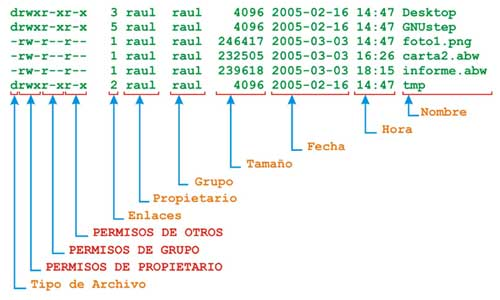
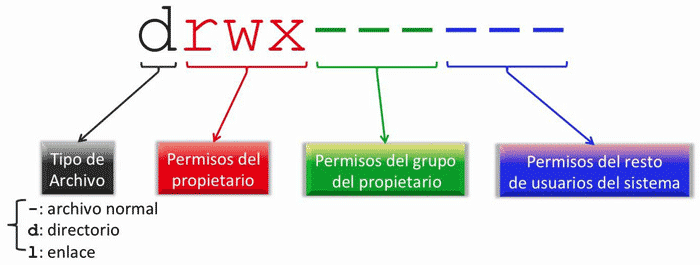

# Guía de terminal

## Git Bash

### Uso básico del editor de texto vi

```bash
touch texto1.md # creamos un archivo

vi texto1.md # abrimos el archivo con el editor vi
```

Ahora vamos a escribir un texto. Para eso debemos indicarle a **vi** que queremos insertar un texto presonando la tecla `i` de **insert**, y luego escribiremos:

```
Este es el primer texto.
```

Para guardar el archivo y salir del editor **vi** pulsaremos en el siguiente orden:

1. tecla `esc`
2. cadena de caracteres `:wq`

Repasemos las acciones básicas en **vi**:

- `i` para insertar
- `ctrl + c` para forzar la salida de cualquier tarea que se esté ejecuantando
- `esc` para salir del modo insertar
- `:wq` **:** para entrar en modo comando, **w** para salvar los cambios (write) y **q** para salir (quit)

### Nuestro primer Bash script

¿Por qué hablamos de scripts? ¿Por qué podemos llegar a escuchar que algunos hablan de lenguajes de programación y lenguajes de scripting?

Los lenguajes de scripting son lenguajes de programación que sus archivos no necesitan ser compilados (convertidos a un archivo binario como por ejemplo los ejecutables (.exe)) sino que son interpretados.

Recordemos que ya hemos dicho que Bash es un intérprete de comandos de línea, por lo tanto también es capaz de interpretar los denominados Bash scripts.

> ¡Por lo tanto sólo necesitamos escribir un guión y decirle a Bash que lo interprete!

A continuación vamos a realizar nuestro primer guión de Bash.

Creo el archivo:

```bash
touch saludo
```

Lo abro con vi:

```bash
vi saludo
```

Lo escribo:

```bash
#!/bin/bash
# Limpia la pantalla y saluda
clear
echo '¡Buenos días!'
echo 'Este es nuestro primer guión de Bash.'
```

### Permisos para la ejecución de un script

Antes de ejecutar nuestro guión debemos asegurarnos de contar con los permisos apropiados para su ejecución.

[SEGUIR CON EL CONTENIDO]






`chmod 755 saludo`

El comando anterior estableció, con el código 755, que el archivo `saludo` puede ser _leido_ y _ejecutado_ por el propietario, el grupo del propietarios y por todos los usuarios del sistema, pero sólo puede ser _escrito_ por el propietario.

Una vez que establecimos los permisos necesarios, podremos ejecutar nuestro script siempre con `./` para indicarle a Bash en qué directorio se encuentra el archivo solicitado:

`./saludo`

> Recomendamos el uso de una calculadora de permisos como la siguiente: https://www.calculadoras.uno/chmod/

### Configurando nuestro shell Bash

[SEGUIR CON EL CONTENIDO]

touch .bashrc

touch .bash_profile

ping google.com
